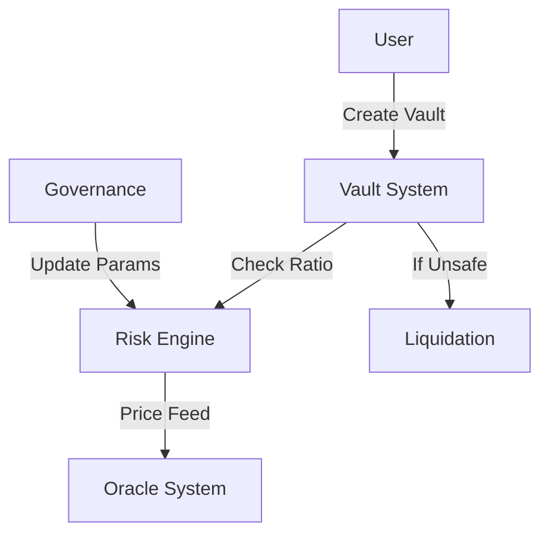

# Bitcoin-Backed Stablecoin System

A decentralized stablecoin protocol implemented on the Stacks blockchain, allowing users to create stablecoins backed by Bitcoin (BTC) collateral. The system implements a CDP (Collateralized Debt Position) model with built-in governance, price oracle integration, and liquidation mechanisms.

## Features

* BTC-collateralized stablecoin minting
* Dynamic collateralization ratio management
* Automated liquidation system
* Multi-oracle price feed support
* Governance controls for risk parameters
* Emergency shutdown capability
* Stability fee mechanism

## System Parameters

* Minimum Collateralization Ratio: 150%
* Liquidation Ratio: 120%
* Annual Stability Fee: 2%
* Maximum Allowed Price: 1,000,000,000
* Minimum Allowed Price: 1
* Maximum Collateral Ratio: 1000%
* Minimum Collateral Ratio: 101%
* Maximum Stability Fee: 100%

## Core Functions

### Vault Management

```clarity
(create-vault (collateral-amount uint))
(mint-stablecoin (amount uint))
(repay-debt (amount uint))
(withdraw-collateral (amount uint))
```

### Liquidation System

```clarity
(liquidate (vault-owner principal))
```

### Price Oracle

```clarity
(update-price (new-price uint))
```

### Governance

```clarity
(set-minimum-collateral-ratio (new-ratio uint))
(set-liquidation-ratio (new-ratio uint))
(set-stability-fee (new-fee uint))
```

## Security Features

- Reentrancy protection
- Emergency shutdown mechanism
- Price validity checks
- Authorization controls
- Parameter boundary validation

## Prerequisites

- Stacks blockchain environment
- Clarity smart contract support
- Access to BTC price oracle
- Governance token implementation

## Installation

1. Clone the repository
2. Deploy the contract to the Stacks blockchain
3. Initialize the system with initial BTC price
4. Set up oracles and liquidators

## Usage

### Creating a Vault

```clarity
;; Transfer collateral and create a vault
(contract-call? .stablecoin create-vault u1000000)
```

### Minting Stablecoins

```clarity
;; Mint stablecoins against deposited collateral
(contract-call? .stablecoin mint-stablecoin u500)
```

### Managing Risk Parameters

```clarity
;; Update minimum collateral ratio (restricted to governance)
(contract-call? .stablecoin set-minimum-collateral-ratio u160)
```

## Risk Management

The system implements several risk management mechanisms:

1. **Minimum Collateralization Ratio (150%)**
   - Ensures adequate collateral backing
   - Provides buffer against price volatility

2. **Liquidation Mechanism**
   - Automatic liquidation at 120% ratio
   - Incentivized liquidator network

3. **Price Oracle System**
   - Multiple oracle support
   - Price validity checks
   - Maximum/minimum price bounds

4. **Emergency Controls**
   - System-wide emergency shutdown
   - Parameter adjustment capabilities
   - Governance oversight

## Architecture



## Contributing

1. Fork the repository
2. Create your feature branch (`git checkout -b feature/your-branch`)
3. Commit your changes (`git commit -m 'Add amazing feature'`)
4. Push to the branch (`git push origin feature/your-branch`)
5. Open a Pull Request

## Testing

```bash
# Run the test suite
clarinet test tests/bitstable-core.test.ts
```

## Future Improvements

- [ ] Implement multi-collateral support
- [ ] Add flash loan protection
- [ ] Enhance oracle system with medianizer
- [ ] Implement governance token voting
- [ ] Add automated stability fee collection
- [ ] Develop liquidation auction mechanism

## License

This project is licensed under the MIT License - see the [LICENSE.md](LICENSE.md) file for details

## Acknowledgments

* MakerDAO for pioneering CDP systems
* Stacks blockchain community
* Bitcoin network

## Contact

* Project Link: [https://github.com/gid-ctl/bitstable.git](https://github.com/gid-ctl/bitstable.git)

## Disclaimer

This software is in beta. Use at your own risk. No guarantee of stablecoin value or system security is provided.